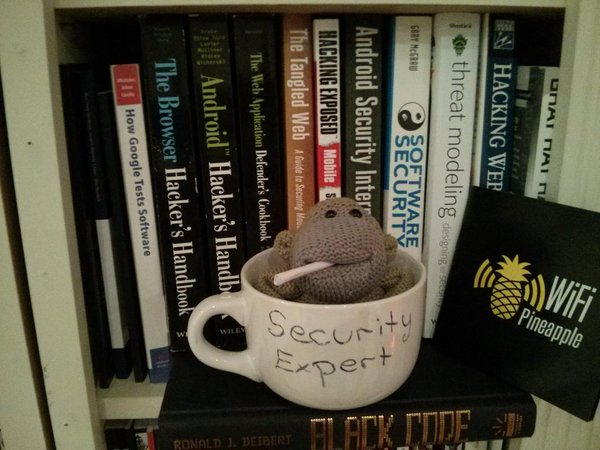

### If you don't have a Security Champion, get a mug

If your developer team doesn't have an assigned security team champion, get one of these mugs.

That 'Security Expert' mug represents the fact that, without a securit champion, when a developer has an application security question, he might as well ask the dude on that mug for help.

I also like the fact that the mug reinforces the idea that for most developer teams, **just having somebody assigned to application security is already a massive step forward!!**

Basically, we have such a skill shortage in our industry for application security developers that **'if you have a heart-beat you qualify'**

#### How to create the SC Mug

  * Get a mug with lots of white space on the front and back
  * write **_Security Champion_** at the front in large letters (but not so big that the text can't be read from a distance)
  * Alternatively, at the back write: **_It's me, or Google, or Stack Overflow_**
  * Or, if you have a small company stuffed animal or object, put it inside the mug

Put the mug in a central location, visible place to the team. It is important that the mug is a neutral place, and not 'assigned' to anybody.

In some teams, I've seen the ritual that when a Security Champion is appointed, he/she gets the mug to put on his/her desk.
