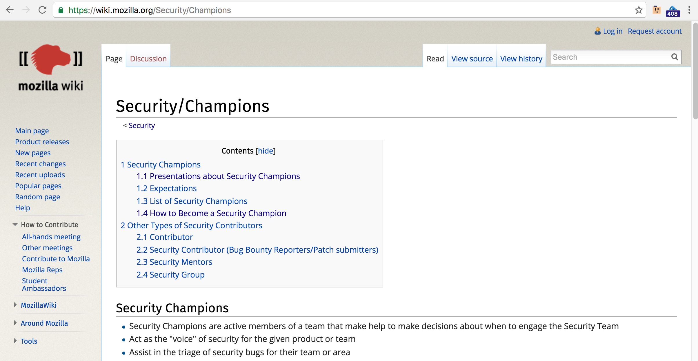

### Public references to Security Champions teams

**Microsoft**

The Microsoft Agile SDL describes them as Team Champions

In [Simplified Implementation of the Microsoft SDL](https://www.microsoft.com/en-us/download/details.aspx?id=12379)

> **Team Champions.** The team champion roles should be filled by SMEs from the project team. These roles are responsible for the negotiation, acceptance, and tracking of minimum security and privacy requirements and maintaining clear lines of communication with advisors and decision makers during a software development project.
> * _Security Champion/Privacy Champion._ This individual (or group of individuals) does not have sole responsibility for ensuring that a software release has addressed all security issues, but is responsible for coordinating and tracking security issues for the project. This role also is responsible for reporting status to the security advisor and to other relevant parties (for example, development and test leads) on the project team.
>  * _Combination of Roles._ As with the security and privacy advisor role, the responsibilities vested in the champion role may be combined if an individual with the appropriate skills and experience can be identified.

In ["The Microsoft SDL Process Template – Making Secure Code Easier"](https://blogs.msdn.microsoft.com/bharry/2009/05/19/the-microsoft-sdl-process-template-making-secure-code-easier/) Brian Harry blog entry says this about Security Champions   

> _With the SDL Process Template, a security owner can easily tackle that initial question of “where do I start”? The Process Guidance page provides a security owner (and the entire team) with a brief overview of the SDL, five steps for Getting Started on an SDL project, and details on customizing the template and extending it for third party security tools. There is even more material supporting SDL implementation and customizing the SDL Process Template in the SharePoint library._

and

> _A security owner can accelerate the task of defining security requirements by opening up a query that includes all of the default SDL requirements – ready to triage and assign! There is also a custom work item to add your own requirements or recommendations_

**Mozilla**

Mozilla has a good pages at https://wiki.mozilla.org/Security and  https://wiki.mozilla.org/Security/Champions.

In the SC page they mention other types of Security Contributors:

* Contributor
* Security Contributor (Bug Bounty Reporters/Patch submitters)
* Security Mentors
* Security Group

Unfortunately this program has ended in 2012 following an [internal reorganisation](https://wiki.mozilla.org/Security/Meetings/2012-01-25)

**OwaspSAMM**

[Owasp SAMM](https://www.owasp.org/index.php/OWASP_SAMM_Project) (Software Assurance Maturity Model) uses the term **Team Champions**

From [Secure_SDLC_Cheat_Sheet](https://www.owasp.org/index.php/Secure_SDLC_Cheat_Sheet)

**BSIMM**

... add details on how BSIMM describes them

**...others?**

... add more
