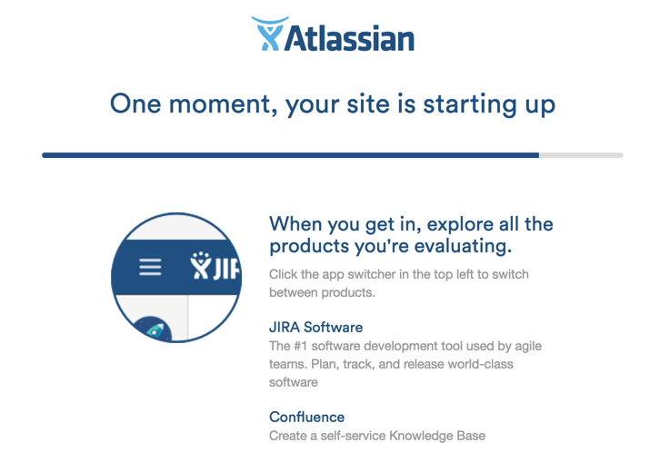
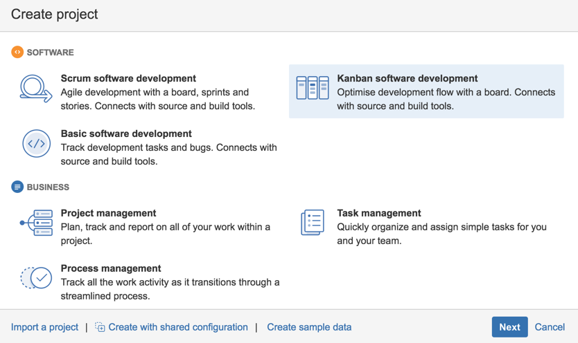

### Creating-a-Jira-project

For these examples we will use the version hosted JIRA cloud called (in Oct 2016) JIRA Software.

Note that the same workflow can be created on the on-premise versions of JIRA (including the older versions)

If you don't have a JIRA server you can use, then use can create on using the [Jira evaluation page]( https://www.atlassian.com/software/jira/try)  and choosing the _JIRA Software_ option. I would also add in the _Documentation_ (aka Confluence) module since it is a very powerful wiki (which is  called _Confluence_)

{width=50%}

If you don't have an account you will need to create one.

{width=50%}

After clicking on _Start now_ your cloud instance of JIRA will be created (my bet is that this is a docker container with a dedicated data store for each customer/trial)

{width=25%}

3) login

{width=25%}

4) create new project

{width=25%}

5) choose Kanban Software Development

{width=25%}

{width=50%}

6) Name it 'RISK - AppSec' with the key 'RISK',

{width=50%}

7) Your new JIRA Project dashboard should open and look something like this

{width=50%}

