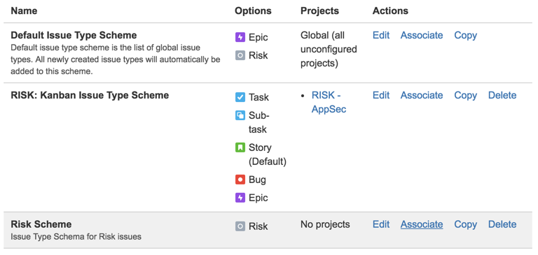
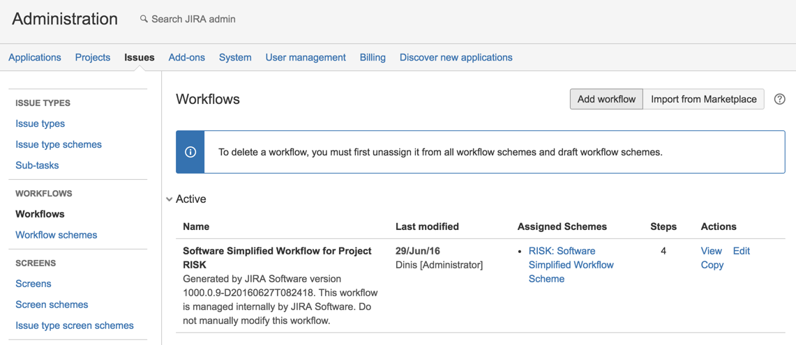
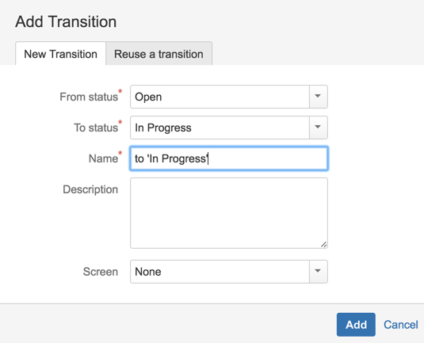
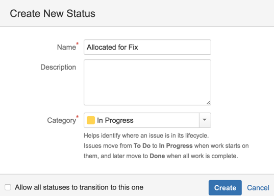
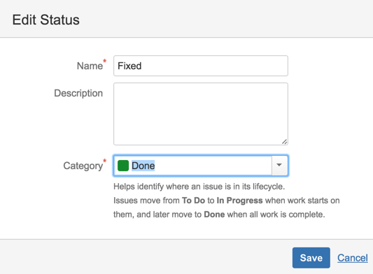
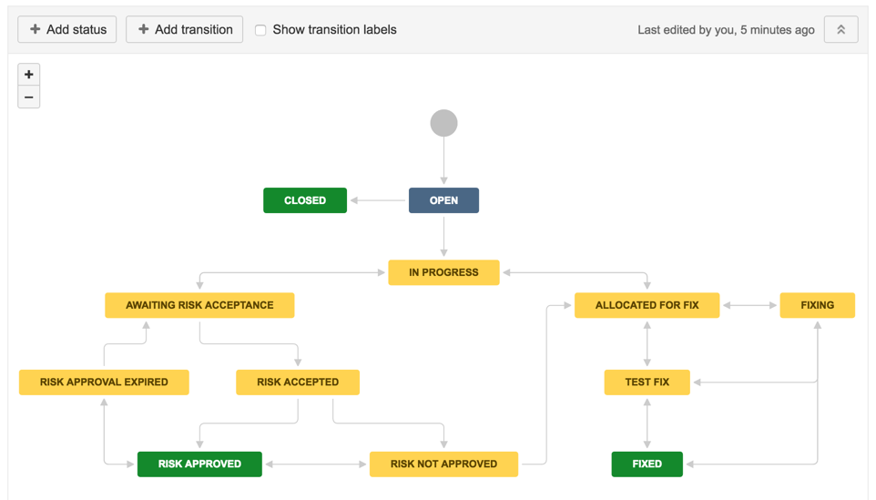
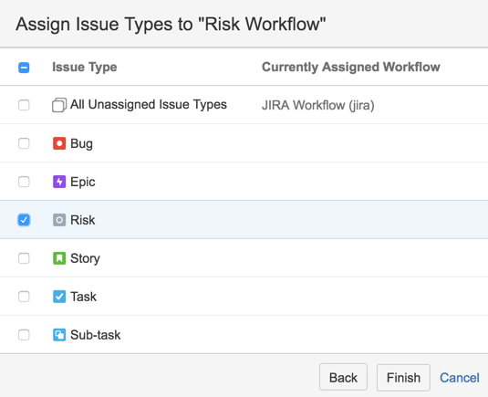
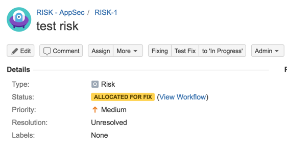
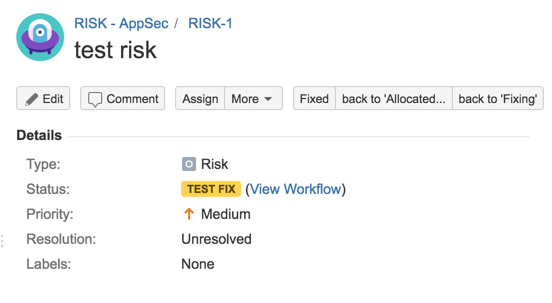
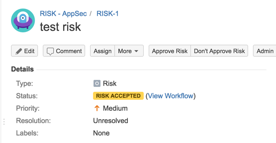

## Step-by-step instructions

**Creating RISK workflow**

as seen here http://blog.diniscruz.com/2016/03/updated-jira-risk-workflow-now-with.html

7) Go to JIRA Administration , Issues

{width=50%}

8) Add an issue type

{width=50%}

9) call it Risk

{width=50%}

10) Go to Issue type schemes and click on 'Add Issue Type Scheme'

{width=50%}

11) Call it Risk Scheme and add the Risk Issue type into to (click Save to continue)

{width=50%}

12) Associate that Risk Scheme

{width=50%}

13) To the 'RISK - AppSec' project

{width=50%}

{width=50%}

14) Go to Workflows and add new one

{width=50%}

15) call it 'Risk Workflow'

{width=50%}

{width=50%}

16) Add status 'In Progress

{width=50%}

{width=50%}

17 ) Create transition from Open to In Progress

{width=50%}

{width=50%}

18) Create a new Status called 'Allocated for Fix'

{width=50%}

{width=50%}

19) add a transition to 'Allocated for Fix' state

{width=50%}

20) how workflow looks like at the moment

{width=50%}

21) Add status: Fixing, Test Fix and Fixed

with fixed set to the 'Done' Category

{width=50%}

21) add transitions to those status

{width=50%}

22) Add Status: Closed, 'Awaiting Risk Acceptance' , 'Risk Accepted', 'Risk Approved', 'Risk Not Approved', 'Risk Approval Expired'

{width=50%}

{width=50%}

{width=50%}

23) Add transitions (including a couple to reverse some of the steps)

{width=50%}

24) Completed workflow should look like this

{width=50%}

25) go to Workflow Scheme and chose to 'Add workflow scheme'

{width=50%}

{width=50%}

26) Add Existing Workflow

{width=50%}

{width=50%}

27) Assign Risk Issue type to it

{width=50%}

{width=50%}

28) exit admin and go to the RISK project's settings

{width=50%}

29) in the Workflow page chose to Switch Scheme

{width=50%}

30) Pick the 'Risk Workflow Scheme'

{width=50%}

{width=50%}

{width=50%}

{width=50%}

{width=50%}

31) Test workflow (fixing path)

{width=50%}

{width=50%}

{width=50%}

{width=50%}

{width=50%}

31) Test workflow (Accept Risk)

{width=50%}

{width=50%}

{width=50%}

{width=50%}

