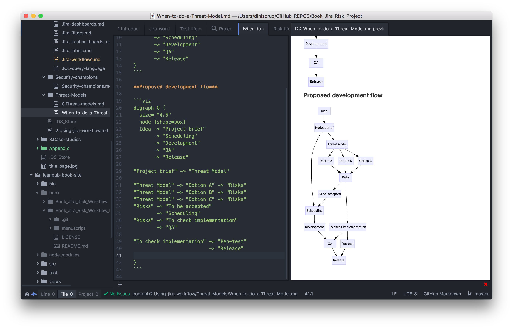

### Atom, Markdown, Graphiz, DOT

Editing and diagram creation was done on [Atom editor](https://atom.io/) with the [markdown-preview-enhanced](https://atom.io/packages/markdown-preview-enhanced) plugin

Text was written in [markdown](https://leanpub.com/help/manual)

Diagrams where created using [DOT Language](http://www.graphviz.org/doc/info/lang.html) , rendered by [GraphWiz](http://www.graphviz.org/) and [Viz.js](https://github.com/mdaines/viz.js)

This is what the IDE looks like:

**References:**

 * GraphWiz and Dot:
   * [Polygon-based Nodes](http://www.graphviz.org/doc/info/shapes.html)
   * [Node, Edge and Graph Attributes](http://www.graphviz.org/doc/info/attrs.html)
   * [Viz.js online demo](http://mdaines.github.io/viz.js/)
